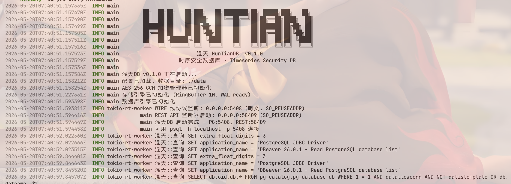

# 混天 DB



时序安全数据库，兼容 PostgreSQL Wire Protocol v3.0。

## 快速开始

### Docker（推荐）

```bash
# 国际 (Docker Hub)
docker pull ctkqiang/huntianandb:v0.1.2.beta

# 中国 (阿里云容器镜像)
docker pull crpi-onofuhwrkmb5z0mn.cn-hangzhou.personal.cr.aliyuncs.com/nezhawanluoanquan/huntiandb:v0.1.2.beta

# 运行
docker run -d \
  -p 5408:5408 -p 3000:3000 -p 5490:5490 \
  -v huntian_data:/app/data \
  ctkqiang/huntiandb:952d3f4e19adb464cd5da2d02edeed1d9a89781e
```

镜像暴露三个端口：

| 端口   | 协议                          | 说明                                            |
| ------ | ----------------------------- | ----------------------------------------------- |
| `5408` | PostgreSQL Wire Protocol v3.0 | `psql`、DBeaver、JDBC、psycopg2 连接            |
| `3000` | HTTP                          | REST API + Web Portal（仪表板、SQL 查询构建器） |
| `5490` | HTTP                          | Prometheus `/metrics` + `/health` + `/ready`    |

### 源码编译

```bash
cd backend && cargo run --release
```

数据库启动后占用两个端口：

- **TCP 5408** -- PostgreSQL Wire Protocol v3.0（可用 `psql`、`psycopg2`、JDBC、DBeaver 连接）
- **TCP 3000** -- REST API + 前端仪表板

## 连接

```bash
# psql 命令行
psql -h 127.0.0.1 -p 5408 -U admin -d huntiandb

# Python
import psycopg2
conn = psycopg2.connect(host="127.0.0.1", port=5408, user="admin", password="admin123", dbname="huntiandb")
```

默认账号：`admin` / `admin123`

## SQL 支持

| 类别   | 命令                                             |
| ------ | ------------------------------------------------ |
| DDL    | `CREATE TABLE`, `DROP TABLE`, `DESCRIBE`         |
| DML    | `INSERT INTO`, `SELECT` (WHERE, LIMIT, ORDER BY) |
| 聚合   | `COUNT`, `SUM`, `AVG`, `MIN`, `MAX`, `GROUP BY`  |
| 元数据 | `SHOW TABLES`, `SHOW USERS`, `SHOW COLUMNS FROM` |
| 用户   | `CREATE USER`, `DROP USER`, `INSERT INTO users`  |

## 用户管理

```sql
-- 标准 SQL 语法
INSERT INTO users (username, role) VALUES ('analyst', 'reader');

-- 或者用内置命令
CREATE USER analyst 'securePass789' reader;
DROP USER analyst;
SHOW USERS;
```

角色：`admin`（管理员）、`writer`（写入者）、`reader`（只读）。
详见 [用户管理](docs/zh/USER_MANAGEMENT.md)。

## 性能基准

数据来自 [bench_1779259126.md](benchmark/reports/bench_1779259126.md) -- 100,000 行、单节点 Apple Silicon macOS、psycopg2 PG wire protocol：

| 指标                |    混天 DB | PostgreSQL 16 | QuestDB 7.x |
| ------------------- | ---------: | ------------: | ----------: |
| INSERT (batch=5000) | 68,741 r/s |    38,000 r/s | 280,000 r/s |
| 点查询 p50          |     0.58ms |         1.2ms |       0.2ms |
| COUNT(\*) 10 万行   |     0.07ms |          35ms |       3.5ms |
| DDL CREATE TABLE    |      4.0ms |          12ms |       8.0ms |
| WAL 每条记录        |   109 字节 |            -- |          -- |

**架构要点：**

- 写入路径使用异步无锁 WAL（crossbeam channel + 后台写入线程），客户端即刻返回
- WAL 格式：zstd 压缩 bincode (v3)，比 JSON 文本小 5 倍
- 聚合函数采用列式缓存向量化，直接迭代 `f64` 连续切片
- PG wire protocol 零摩擦兼容现有 PostgreSQL 工具链（Grafana、DBeaver、psycopg2）

## 架构

```
前端 (React + TDesign + Monaco Editor)
    |
REST API (axum)  +  PG Wire Protocol (tokio)
    \                    /
      数据库引擎 (内存 + WAL 持久化)
              |
    data/recovery.log  (zstd 压缩 bincode, 异步写入)
```

## 前端

```bash
cd frontend && bun install && bun run dev
```

访问 `http://localhost:3000`，提供：

- **仪表板** -- 实时安全事件监控，含吞吐量面积图、事件类型分布柱状图、事件流 Feed
- **SQL 查询构建器** -- 多标签页 Monaco 编辑器，含数据表浏览器、查询历史、示例查询
- **事件查看器** -- 分页安全事件表格，支持筛选
- **设置** -- 系统信息与配置

## 可观测性

混天 DB 内置 Prometheus 指标端点，提供生产级监控能力。

**端点：** 默认 `:5490/metrics`（通过 `METRICS_PORT` / `PROMETHEUS_PATH` 配置）

**指标：**

| 指标                                | 类型      | 说明                             |
| ----------------------------------- | --------- | -------------------------------- |
| `huntian_wal_fsync_seconds`         | Histogram | WAL fsync 耗时分桶 [0.1ms-100ms] |
| `huntian_wal_size_bytes`            | Gauge     | WAL 文件当前大小                 |
| `huntian_wal_replay_lsn`            | Gauge     | WAL 回放最后 LSN                 |
| `huntian_memory_usage_bytes`        | Gauge     | 进程 RSS 内存                    |
| `huntian_open_fds`                  | Gauge     | 打开的文件描述符数               |
| `huntian_active_queries`            | Gauge     | 当前执行中的查询数               |
| `huntian_slow_queries_total`        | Counter   | 慢查询总数                       |
| `huntian_checksum_failures_total`   | Counter   | 校验和失败次数                   |
| `huntian_query_duration_seconds`    | Histogram | 查询耗时分桶 [1ms-10s]           |
| `huntian_snapshot_duration_seconds` | Histogram | 快照耗时分桶 [10ms-60s]          |
| `huntian_events_written_total`      | Counter   | 写入事件总数                     |

**健康检查：**

- `GET /health` — 200 若服务存活
- `GET /ready` — 200 若数据库已完成恢复并接受查询

```bash
# 启动时配置指标端口
METRICS_PORT=5490 PROMETHEUS_ENABLED=true cargo run

# 验证
curl http://localhost:5490/metrics
curl http://localhost:5490/health
```

**配置：**

| 环境变量             | 默认值   | 说明                     |
| -------------------- | -------- | ------------------------ |
| `PROMETHEUS_ENABLED` | true     | 启用/禁用指标端点        |
| `METRICS_PORT`       | 5490     | 指标 HTTP 端口（0=禁用） |
| `PROMETHEUS_PATH`    | /metrics | 指标导出路径             |

## 文档

| 文档                                          | 语言 |
| --------------------------------------------- | ---- |
| [README (English)](README_EN.md)              | EN   |
| [用户管理](docs/zh/USER_MANAGEMENT.md)        | ZH   |
| [User Management](docs/en/USER_MANAGEMENT.md) | EN   |
| [架构说明](docs/zh/ARCHITECTURE.md)           | ZH   |
| [安全说明](docs/zh/SECURITY.md)               | ZH   |

## 许可证

MIT
